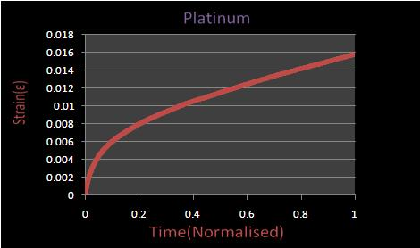
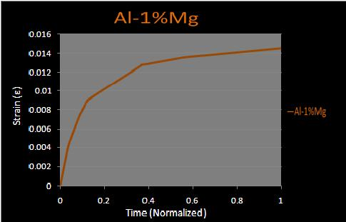
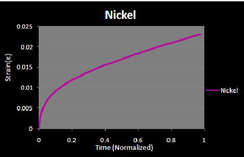
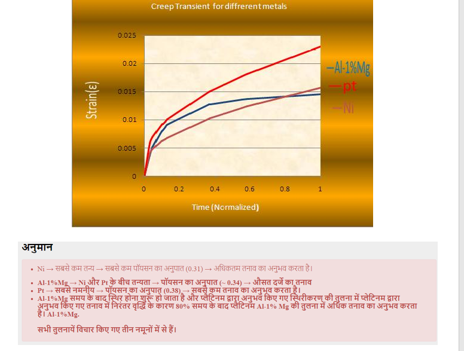

विरूपण प्रगतिशील है यानी धातु की उपज शक्ति के नीचे एक निरंतर तनाव पर धातु का स्थायी और समय पर निर्भर विकृति। विरूपण सभी प्रकार की धातु में देखा जाता है और उन धातुओं में गंभीर रूप से देखा जाता है जिनका उपयोग लंबे समय तक उच्च परिचालन तापमान वाले अनुप्रयोगों में किया जाता है। विरूपण के कारण होने वाली विकृति हमेशा विनाशकारी नहीं होनी चाहिए अर्थात यदि कोई घटक अनुप्रयोग की सहनीय सीमा से परे विरूपण से विकृत हो जाता है, तो समग्र रूप से आवेदन विफल हो सकता है, भले ही घटक वास्तव में फ्रैक्चर न हुआ हो। साथ ही यह हमेशा एक अवांछनीय गुण नहीं होती है, उदाहरण के लिए कंक्रीट में अंतर्निर्मित तन्यता तनाव होते हैं जो इसके फ्रैक्चर का कारण बन सकते हैं, हालांकि, कुछ मध्यम विरूपण के कारण ये तनाव दूर हो जाते हैं और संरचना बच जाती है। यह ध्यान रखना महत्वपूर्ण है कि "स्थायी" और "समय पर निर्भर" शब्द बहुत महत्वपूर्ण हैं क्योंकि विरूपण प्रत्यास्थ नहीं है और न ही यह भंगुर है। तनाव समय के साथ बनता रहता है। विरूपण हालांकि विभिन्न कारकों पर निर्भर करता है, आमतौर पर तापमान में वृद्धि के साथ विस्तार देखा जाता है। यह उन धातुओं के लिए विशेष रूप से महत्वपूर्ण है जिनका परिचालन तापमान 0.4Tm से अधिक है और यहां तक ​​कि अनाकार पॉलिमर भी विरूपण के प्रति संवेदनशील हैं। 
  <a href="https://youtu.be/EazzyT0qU44" target=_blank>NPTEL व्याख्यान लिंक</a>

 
<video width="500" height="240" controls>
  <source src="images/cmf.mp4" type="video/mp4">
  Your browser does not support the video tag</video>
 
  

विभिन्न धातु में अलग-अलग गुण होते हैं और इसलिए विरूपण प्रत्येक धातु में भिन्न होता है। यह टंगस्टन के लिए होता है, जिसमें बहुत अधिक गलनांक होता है, बहुत अधिक तापमान (1370 C) पर होता है जबकि सोल्डर, लेड आदि के लिए, जिसमें बहुत कम गलनांक होता है, यह कमरे के तापमान पर होता है। इसके अलावा चूंकि विरूपण वक्र विभिन्न कारकों जैसे बाधा घनत्व, शक्ति आदि पर निर्भर करता है, यह विभिन्न प्रकार की धातु जैसे सिरेमिक, पॉलिमर और धातुओं के लिए व्यापक रूप से भिन्न होता है। किसी धातु की ताकत जितनी अधिक होती है, वह विरूपण के प्रति उतना ही अधिक प्रतिरोध दिखाती है। भंगुर धातु के लिए जो आम तौर पर एक प्लास्टिक सतह नहीं दिखाती है, विरूपण व्यवहार नमनीय धातु से बहुत अलग होता है। विभिन्न प्रकार की धातुओं में विरूपण के व्यवहार की तुलना के लिए आप दाहिना कॉलम में दिए गए लिंक देख सकते हैं।  

<b>परिणाम</b>  
 
प्लैटिनम(Platinum)  
 
एलुमिनियम-मैग्नीशियम(Aluminum-Magnesium)  
 
निकल(Nickel)  
<b>Conclusions</b>  
 
